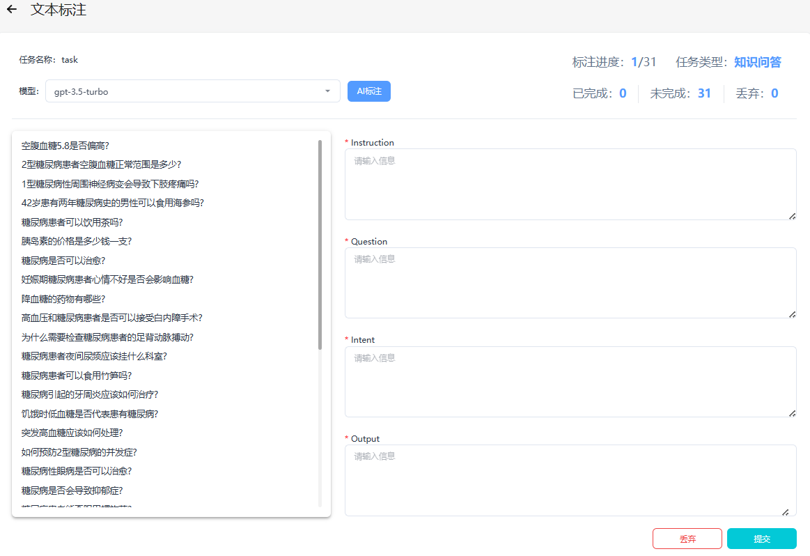
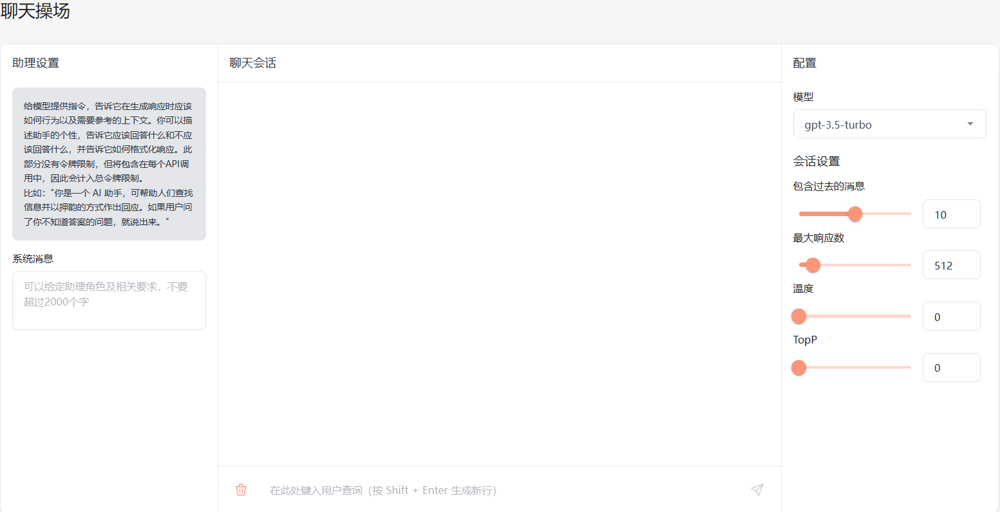

<div align=center></div>


<div align=center><h1><b>构建、训练、部署：LLM-And-More让一切变得更简单</b></h1></div>


<!-- \[ [English](README.md) | 中文 \]-->

## LLM-And-More: 从创意到服务的一站式LLM解决方案

LLM-And-More 是一站式大模型训练及应用构建的解决方案，其覆盖了从数据处理到模型评估、从训练到部署、从想法到服务等整个流程。在本项目中，用户可以轻松地通过本项目进行模型训练并一键生成所需的产品服务。

本项目的优势主要体现在以下三点:
 - 总结了不同应用场景下的专业知识和最佳实践，以保证模型在实际生产中的表现优异。
 - 集成了高性能模型并行框架，有效地减少了训练和推理时的算力开销。
 - 用户可以基于自身需要定制化模型及服务，便捷且自由度高。

https://github.com/IceBearAI/LLM-And-More/assets/9782796/cc410f8e-00eb-46d3-820f-03860ea4f743

如有任何问题，欢迎加入我们的微信群交流！
<div align=center></div>

## 目录

- [功能模块](#功能模块)
- [支持场景](#支持场景)
- [适配模型](#适配模型)
- [安装与使用](deployment.md)
- [系统架构设计](sys_architecture.md)

## 功能模块

LLM-And-More致力于为专业开发者和一线业务人员提供专业、易用的LLM应用构建方案。LLM-And-More将LLM应用开发过程分解为以下六个模块：

- [数据模块](#数据模块)
- [训练模块](#训练模块)
- [监控模块](#监控模块)
- [评估模块](#评估模块)
- [部署模块](#部署模块)
- [交互模块](#交互模块)

这些模块涵盖了开发一个LLM产品服务的所有细节。通过注入专业知识和性能优化组件，全流程协助用户构建符合自身需求的LLM应用。

### 数据模块

数据模块是构建LLM应用的首要组成部分，直接影响最终效果。LLM-And-More提供全面的数据标注平台，包括任务管理、分配和自主标注功能。标注完成后，数据自动转换为模型可处理的jsonl格式，并存入本地数据库，以便后续训练和评估模块使用。此外，LLM-And-More还提供了数据质量一键检测，用户可通过检测报告发现标注过程中可能存在的错误，从而提升模型训练的最终效果。



### 训练模块

训练模块LLM应用构建中最关键、最复杂的部分。LLM-And-More提供了一个即开即用的高性能模型训练框架。该框架使用户无需深入了解深度学习，即可轻松实现最佳实践。在训练模块中，用户可以自由调整基座模型、训练方式、批处理大小、学习率等超参数。如果用户对此不甚了解，LLM-And-More提供智能默认参数，帮助用户选择和调整参数。此外，LLM-And-More还自动为用户提供DeepSpeed多卡多机加速适配，节省训练时间，最大程度利用算力资源。


### 监控模块

在训练过程中，用户可能会面临无法清晰观察模型性能变化的困扰。LLM-And-More提供智能化的模型训练监控模块，实时可视化显示CPU、GPU等核心算力资源的使用情况，并监控模型损失、学习率、训练步数的变化。此外，监控模块会智能提示用户可能存在的模型性能风险，并提供适当的解决方案建议。例如，当系统提示“过拟合风险”时，建议“停止训练，降低学习率或增大数据量”，用户可以据此调整训练策略，避免不必要的算力浪费，更准确地把握模型性能。


### 评估模块

训练结束后，LLM-And-More提供评估模块，其分为两个主要任务：一是评估模型在训练任务上的性能，检验其在特定任务上的表现；二是评估模型在五个通用维度上的能力，包括推理、阅读理解、语言理解、指令遵从和创新。用户可根据两方面的评估结果调整训练数据和迭代次数，选择最适合的模型应用于线上系统。


### 部署模块(Coming Soon)

### 交互模块(Coming Soon)

## 支持场景

除了简单的提供输入输出训练LLM应用外，我们还提供了丰富的场景支持，可以帮助用户更好的解决在工作生产当中遇到的复杂问题。例如，用户可以基于FAQ场景适配方案，直接构建一个客服，协助完成识别客户意图、解决淘宝店铺自动回复的问题；或是基于RAG场景方案，构建一套企业内部规章制度问答机器人。所有场景均具备独立的六个功能模块，但拥有深度定制的UI和专业Know-How。LLM-And-More支持以下场景：

- [通用场景](#通用场景)
- [FAQ场景](#FAQ场景)
- [RAG场景](#RAG场景)
- [创意写作场景](#创意写作场景)
- [Agent场景](#Agent场景)

### 通用场景

该场景可以接受任意的输入输出，这是最基础的训练场景。在该场景中，我们没有针对数据特征、应用范围等做任何假设，在数据、训练、监控、评估、部署、交互模块中的各项参数均调整至最均衡的水平，并适配了任何场景均有收益的专业Know-How辅助模型训练。总的来说，如果用户不确定应该使用哪个场景，或认为LLM-And-More提供的任何场景均不符合您的要求，您可以选用该场景来开始您的构建。



### FAQ场景

该场景适用于FAQ客服或FAQ问答机器人。FAQ(Frequently Asked Questions)
即常见问题，通常应用于客服、快速助手、和在线论坛等场景，在这些场景中常见问题往往会反复出现，例如，用户经常以各种不同的表达方式询问发货时间。在FAQ场景中，用户的问题往往被归类，并对于每一类问题有一个统一的回答，例如针对询问发货时间的问题，统一回复“我们将尽快安排发货，请及时查看物流信息”。直接尝试使用大模型生成这些回答往往是事倍功半的，因为没有充分利用数据的特征，很难让大模型回复保持稳定，且常常会发生幻觉现象。为此，我们为FAQ场景设计了涵盖全部六个模块的全流程解决方案，主要引入用户意图识别，让LLM预测用户意图（在上述例子中，“查询物流信息”），而不是直接预测回复（在上述例子中，“我们将尽快安排发货，请及时查看物流信息”）。我们在大量FAQ场景中的实验表明，该解决方案可以提升30%以上的回复准确率，并显著降低模型过拟合风险与幻觉现象。

### RAG场景(Coming Soon)

### 创意写作场景(Coming Soon)

### Agent场景(Coming Soon)

## 适配模型

为了支持更广泛的应用，LLM-And-More支持多种多样的模型，并支持用户选择多种不同的训练方式。

| 模型名                                                  | 模型大小                    | 支持的训练方法    |
|------------------------------------------------------|-------------------------|------------|
| [Baichuan2](https://huggingface.co/baichuan-inc)     | 7B/13B                  | 全参数训练/Lora |
| [ChatGLM3](https://huggingface.co/THUDM/chatglm3-6b) | 6B                      | 全参数训练/Lora |
| [LLaMA](https://github.com/facebookresearch/llama)   | 7B/13B/33B/65B          | 全参数训练/Lora |
| [LLaMA-2](https://huggingface.co/meta-llama)         | 7B/13B/70B              | 全参数训练/Lora |
| [Qwen](https://huggingface.co/Qwen)                  | 0.5B/1.8B/4B/7B/14B/72B | 全参数训练/Lora |


### 模型微调

为了实现模型的微调，您可以参考我们的详细指南：[模型微调](docs/model/finetune.md)。

### 模型部署与微调

您可以将模型部署到任意配备GPU的节点上，无论是私有的K8s集群、Docker集群，还是云服务商提供的K8s集群，均能轻松完成对接。


## 安装及使用

- 克隆项目: `git clone https://github.com/IceBearAI/LLM-And-More.git`
- 进入项目: `cd aigc-web`

该系统依赖**Docker**需要安装此服务

推理或训练节点只需要安装**Docker**和**Nvidia-Docker**
即可。[NVIDIA Container Toolkit](https://github.com/NVIDIA/nvidia-container-toolkit)

### 本地开发

[golang](https://github.com/golang/go)版本请安装go1.21以上版本

- 安装依赖包: `go mod tidy`
- 本地启动: `make run`
- build成x86 Linux可执行文件: `make build-linux`
- build成当前电脑可执行文件: `make build`

build完通常会保存在 `$(GOPATH)/bin/` 目录下

### Docker-compose部署

安装docker和docker-compose可以参考官网教程：[Install Docker Engine](https://docs.docker.com/engine/install/)

需要在 当前目录下增加 `.env` 文件来设置相关的环境变量。

执行命令启动全部服务

```
$ docker-compose up
```

如果不需要执行build流程，可以进入到`docker`目录下执行`docker-compose up`即可。或把`docker-compose.yaml`的`build`注释掉。

<p align="center" width="100%">

</p>