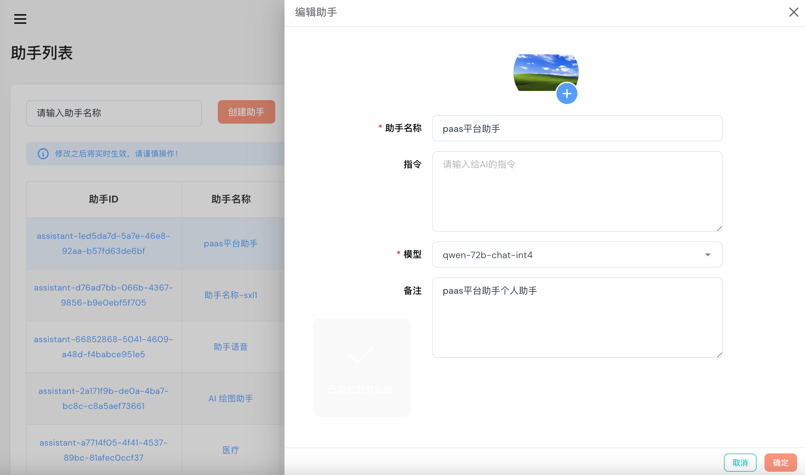
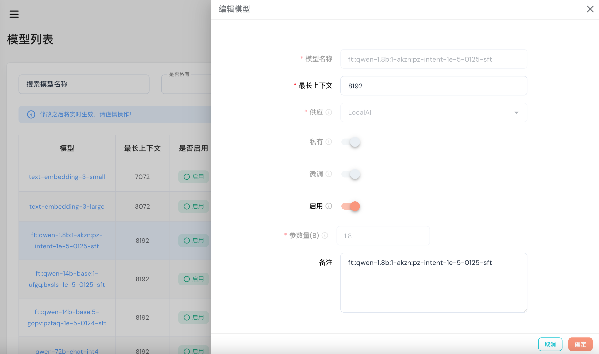
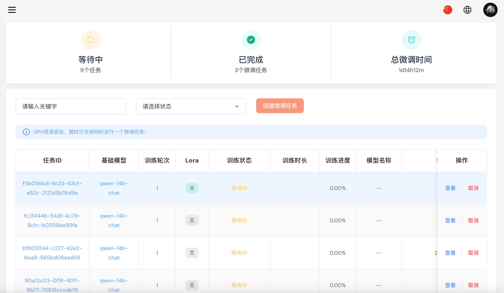
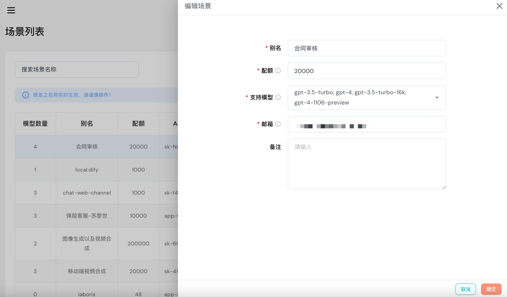

# aigc-admin-web

### 📖 介绍

- aigc-admin-web 是一款基于 Vue3、TypeScript、Vite、Pinia、Element-Plus、Vuetify 开源的 AI 模型管理后台，项目支持国际化。项目框架原型参照[Flexy Vue 3 vuetify](https://preview.themeforest.net/item/flexy-vuetify-vue3-dashboard/full_screen_preview/42100104?clickid=VfFzUd3jpxyPTtd2du3D4ULrUkFWAjUB4w3rWY0&iradid=289206&iradtype=BANNER&irgwc=1&irmptype=mediapartner&irpid=1386563&mp_value1=&utm_campaign=af_impact_radius_1386563&utm_medium=affiliate&utm_source=impact_radius)。
- aigc-admin-web AI 模型管理后台分为前、后端两个项目。本项目为前端项目，依赖的接口服务的后端项目为 [aigc-admin](https://github.com/IceBear-CreditEase-LLM/aigc-admin) 。

### 🚀 开发

1. node 建议版本 16 ~ 18
2. pnpm 版本 7.9.5

```shell
# 卸载 pnpm
sudo npm uninstall pnpm -g

# 安装指定版本 pnpm
sudo npm install -g pnpm@7.9.5 --registry=https://registry.npmmirror.com/
```

### 📦 代码仓库

- GitHub：https://github.com/LLM-And-More/aigc/aigc-web

### 🔨 项目功能

- 使用 Vue3 + TypeScript 开发，单文件组件**＜ script setup ＞**
- 采用 Vite4 作为项目开发、打包工具（配置 Gzip 打包、TSX 语法、跨域代理…）
- 使用 Pinia 替代 Vuex，轻量、简单、易用，集成 Pinia 持久化插件
- 使用 TypeScript 对 Axios 整个二次封装（请求拦截、取消、常用请求封装…）
- 使用 Vuetify 作为 主 UI 框架。
- 使用 Element-Plus 少量功能，弥补 Vuetify 的不足。
- 使用 VueRouter 进行路由权限拦截、页面按钮权限配置、路由懒加载
- 使用 KeepAlive 对页面进行缓存，支持多级嵌套页面缓存
- 常用自定义指令开发（复制）
- 使用 Prettier 统一格式化代码，集成 ESLint 代码校验规范

### 📔 安装使用步骤

- **克隆项目:**

```bash
git clone
```

- **安装依赖:**

```text
pnpm install
```

- **开发:**

```text
pnpm dev
```

- **构建:**

```text
pnpm build
```

- `vite.config.ts` 文件中，接口代理地址 改为后端服务地址
- 测试账号 admin、密码 admin

### 🌠 项目截图

- 国际化中文：

  

- 国际化英文：

  

- 助手列表：

  

- 工具列表：

  

- 模型设置：

  

- 模型聊天操场：

  

- 微任务列表：

  

- 场景设置：

  

- 数据字典设置：

  

- 模版设置：

  

### 🌎 浏览器支持

- 本地开发推荐使用 Chrome 最新版浏览器 [Download](https://www.google.com/intl/zh-CN/chrome/)。
- 生产环境支持现代浏览器，不再支持 IE 浏览器，更多浏览器可以查看 [Can I Use Es Module](https://caniuse.com/?search=ESModule)。

|  |  |  |  |  |
| ----------------------------------------------- | --------------------------------------------------- | --------------------------------------------------------- | ------------------------------------------------------- | ------------------------------------------------------- |
| not support                                     | last 2 versions                                     | last 2 versions                                           | last 2 versions                                         | last 2                                                  |

### 🧩 后项目

- [aigc-server](https://github.com/LLM-And-More/aigc)

### 📚 文件资源目录

```text
aigc-admin-web
├─ .vscode                # VSCode 推荐配置
├─ build                  # Vite 配置项
├─ public                 # 静态资源文件（该文件夹不会被打包）
├─ src
│  ├─ assets              # 静态资源文件
│  ├─ components          # 公共组件
│  ├─ directives          # 全局指令文件
│  ├─ enums               # 项目常用枚举
│  ├─ hooks               # 常用 Hooks 封装
│  ├─ layouts             # 框架布局模块
│  ├─ plugins             # vue 插件（全局组件、vuetify引入）
│  ├─ routers             # 路由管理
│  ├─ scss                # 全局样式文件
│  ├─ stores              # pinia store
│  ├─ theme               # 主题样式
│  ├─ typs                # 全局 ts 声明
│  ├─ utils               # 常用工具库
│  ├─ views               # 项目所有页面
│  ├─ App.vue             # 项目主组件
│  └─ main.ts             # 项目入口文件
├─ types                  # 全局 ts 声明
├─ .editorconfig          # 统一不同编辑器的编码风格
├─ .env                   # vite 常用配置
├─ .env.development       # 开发环境配置
├─ .env.production        # 生产环境配置
├─ .env.test              # 测试环境配置
├─ .eslintignore          # 忽略 Eslint 校验
├─ .eslintrc.cjs          # Eslint 校验配置文件
├─ .gitignore             # 忽略 git 提交
├─ .prettierignore        # 忽略 Prettier 格式化
├─ .prettierrc.cjs        # Prettier 格式化配置
├─ LICENSE                # 开源协议文件
├─ README.md              # README 介绍
├─ index.html             # 入口 html
├─ package.json           # 依赖包管理
├─ package-lock.yaml      # 依赖包包版本锁
├─ tsconfig.json          # typescript 全局配置
└─ vite.config.ts         # vite 全局配置文件
```
