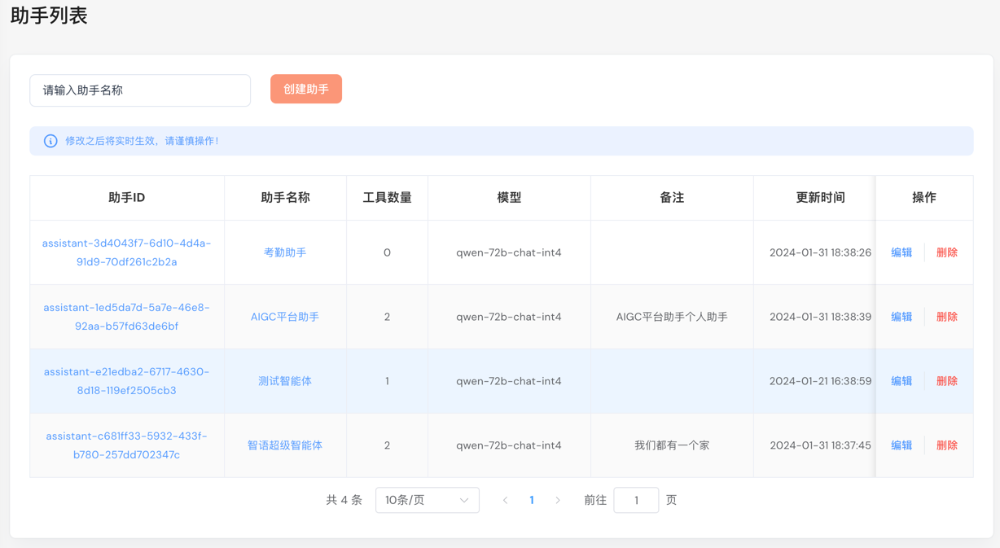
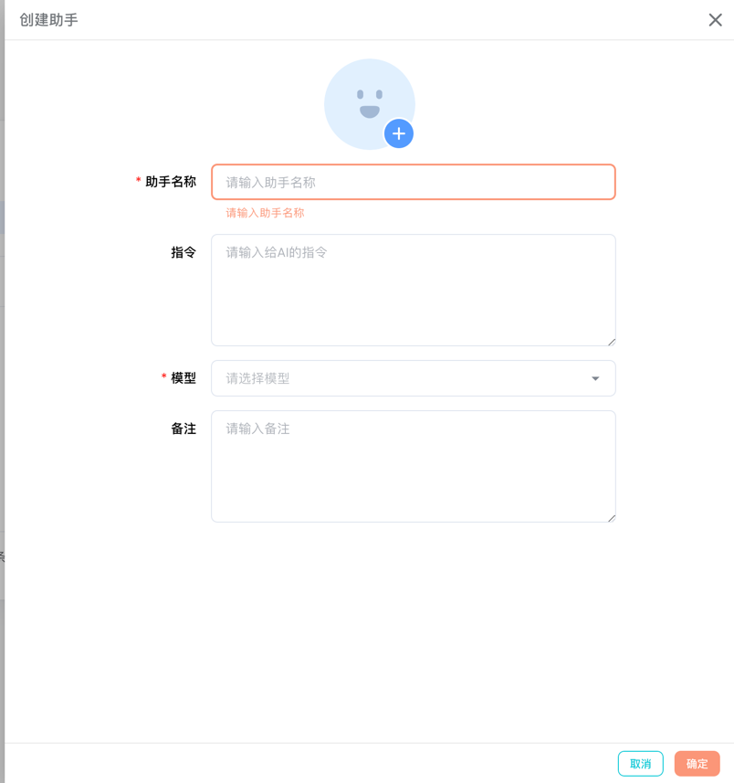

# 助手列表

管理当前租户下的所有助手。



## 创建助手

点击“**创建助手**”按钮，弹出对话框。

- **助手名称**: 助手的别名，用于标识助手。
- **指令**: 给助手的指令，通常不用填默认会给传入
- **模型**: 选择助手使用的模型



默认指令:

```
To use a tool, please use the following format:

Thought: Do I need to use a tool? Yes
Action: the action to take, should be one of [{{.tool_names}}]
Action Input: the input to the action
Observation: the result of the action

When you have a response to say to the Human, or if you do not need to use a tool, you MUST use the format:

Thought: Do I need to use a tool? No
AI: [your response here]

```