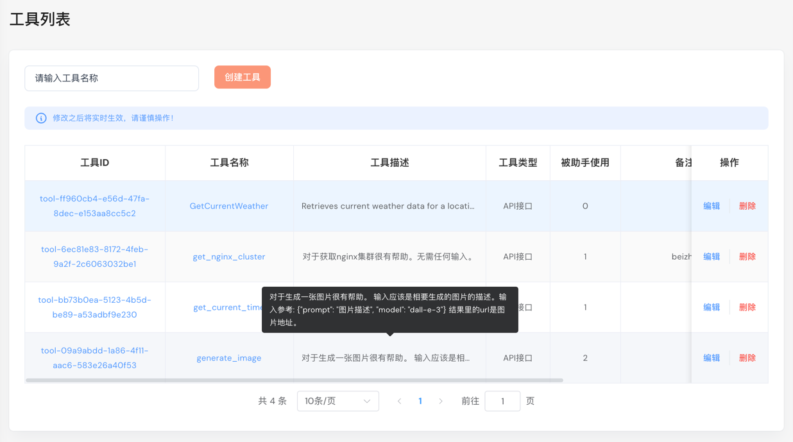
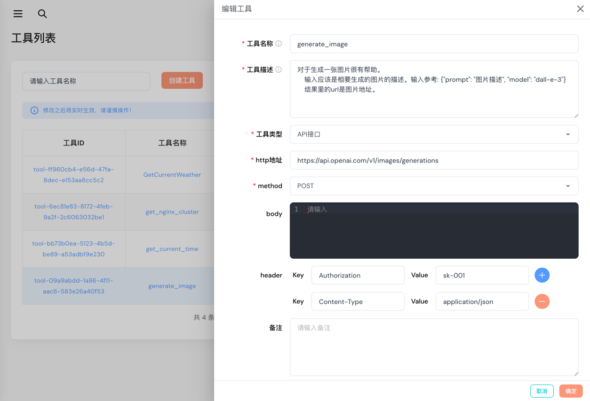
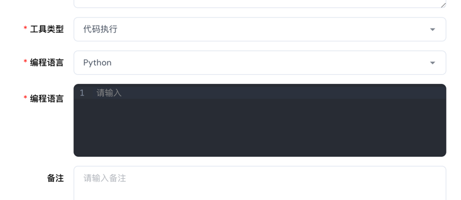

# 工具管理

管理助手可能会使用到的一些工具。

## 创建或编辑工具

点击“**添加工具**”按钮，或编辑按钮，弹出对话框。

- **工具名称**: 工具的别名，用于标识工具。
- **工具描述**: 工具的描述，用于描述工具的作用。
- **工具类型**: 选择工具的类型，目前支持的工具类型
 - API调用
 - 执行代码
 - 知识库

不同的工具类型所需输入的内容也不一样。

