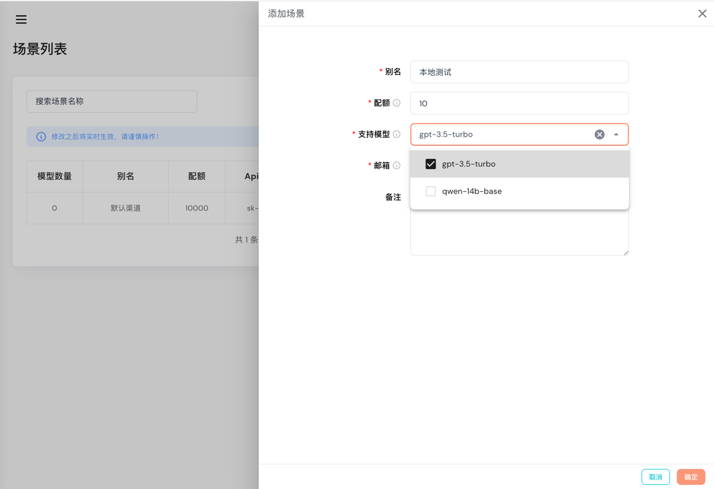

# 应用场景

当前租户下可创建多个应用场景，就相当于每个应用可以创建一个apiKey，并赋予该应用场景可使用的模型及调用的配额。

### 添加/编辑应用场景

点击“**添加场景**”按钮，弹出抽屉可在对话框中配置相应参数。

- **别名**: 应用场景的别名，用于标识应用场景。
- **配额**: 该应用场景的配额，即该应用场景可调用的次数。
- **支持模型**: 该应用场景支持的模型，即该应用场景可调用的模型。
- **邮箱**: 该应用场景的邮箱，用于接收调用相关信息。

