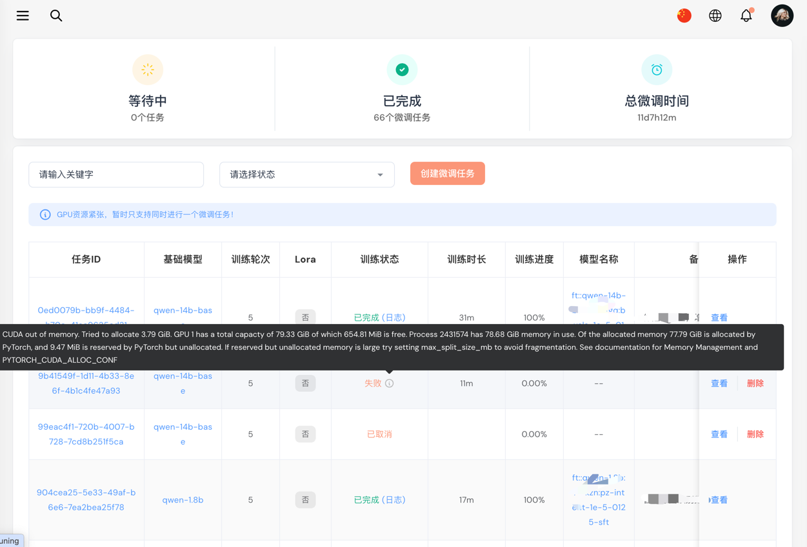
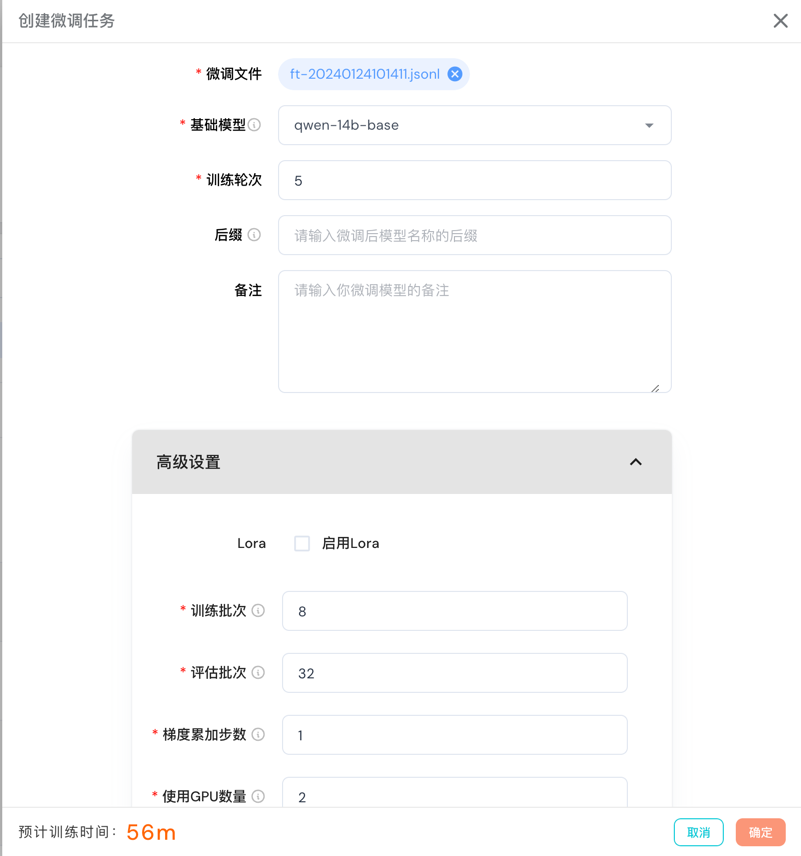
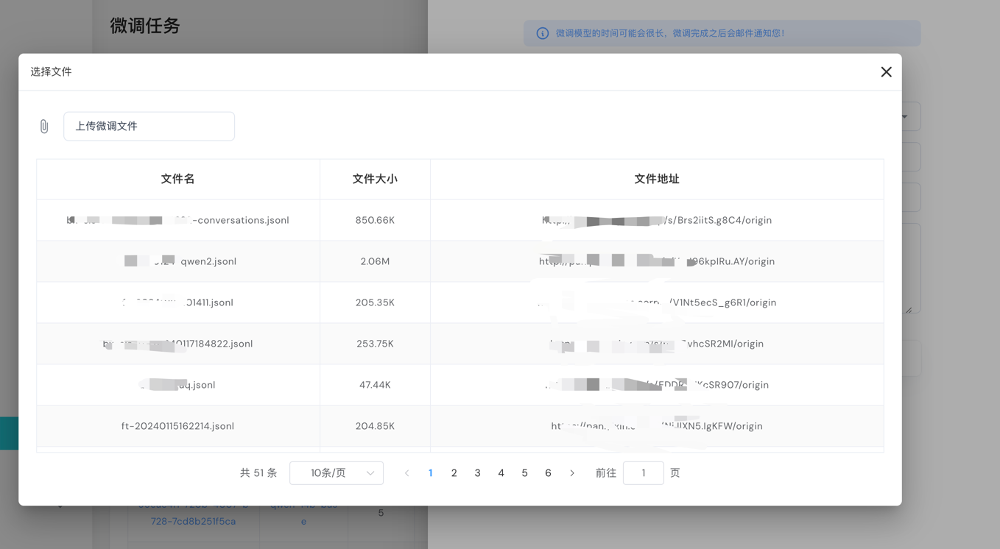
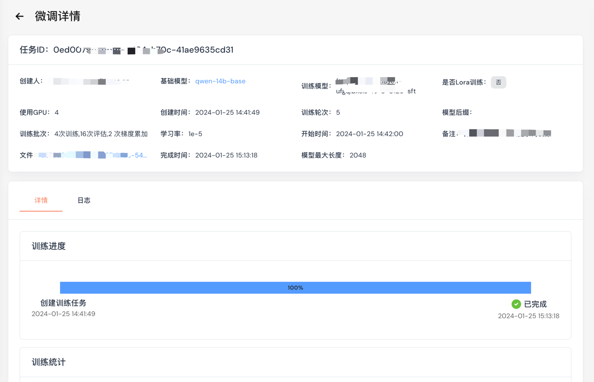
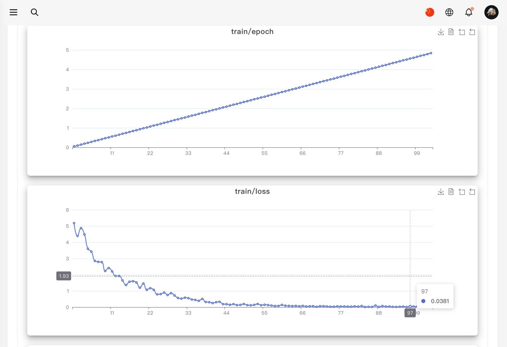
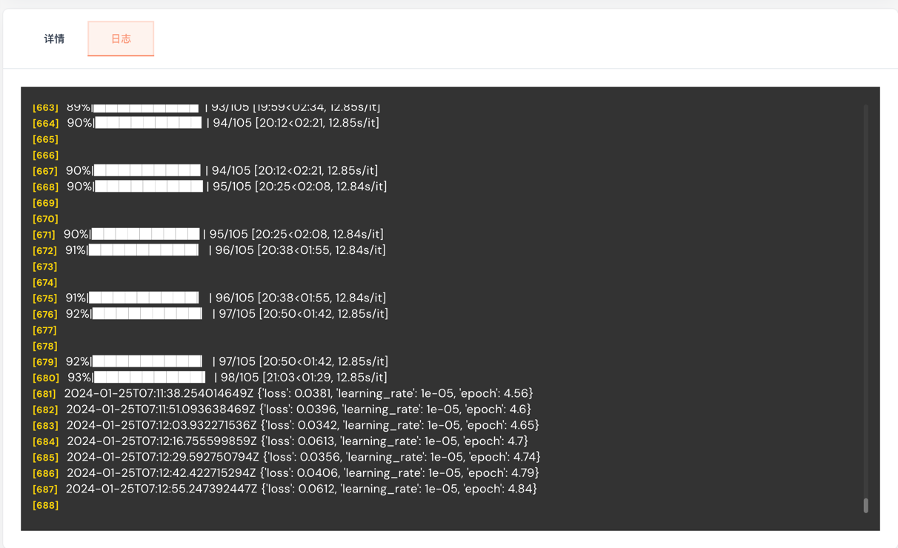

# 模型微调

> 模型微调是指在已经训练好的模型上，继续训练以适应新的数据集。在模型微调中，我们可以选择是否冻结模型的一部分层，以及是否使用不同的学习率。

在当前页面可以对模型的微调进行管理。

## 微调整列表

列表显示了所有的微调任务，包括微调任务的名称、模型名称、数据集名称、微调状态、微调开始时间、微调结束时间、微调耗时、微调日志、操作等。

当微调任务正在进行中时，可以点击“**取消**”按钮结束微调任务。

当觉得微调任务不再需要时，可以点击删除按钮删除微调任务。

点击列表的正在训练的任务“**日志**”，可查看训练日志。



## 创建微调任务

点击创建微调任务，弹出对话框。

- **微调文件**: 选择或上传微调文件文件格式为JSONL格式，每行为一个样本，样本格式为
  ```{"messages": [{"role": "user", "content": "What's the capital of France?"}, {"role": "assistant", "content": "Paris, as if everyone doesn't know that already."}]}```。
- **基础模型**: 选择基础模型，目前暂时只支持私有本地模型，如果没有可在[模型管理](list.md)添加模型
- **训练轮次**: 训练轮次
- **后缀**: 微调后模型名称的后缀，通常微调名称为 ft::{模型}:{渠道}:-{随机}:{后缀}
- **训练批次**: 即一次训练所抓取的数据样本数量
- **评估批次**: 用于评估的每个 GPU/TPU 核心/CPU 的批量大小
- **梯度累加步数**: 在执行向后/更新传递之前累积梯度的更新步骤数
- **使用GPU数量**: 使用GPU数量，单节点最大是8
- **学习率**: AdamW 优化器的初始学习率
- **模型最大长度**: 模型支持的最大上下文长度



选择或上传文件对话框



## 微调详情

点击JobId或名称，可查看微调任务的详情。



模型微调的损失率和准确率的变化曲线



微调日志

