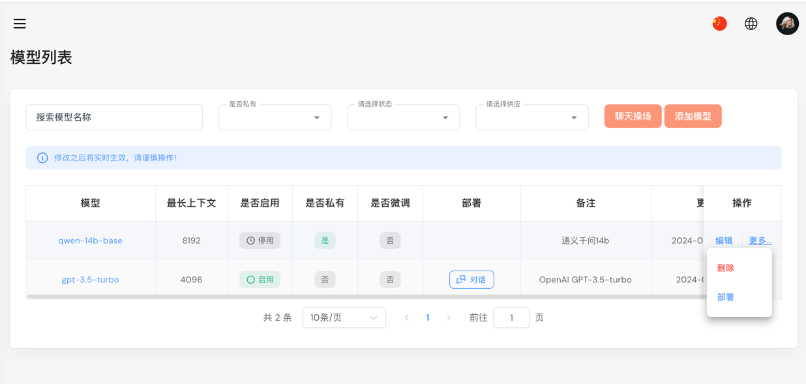
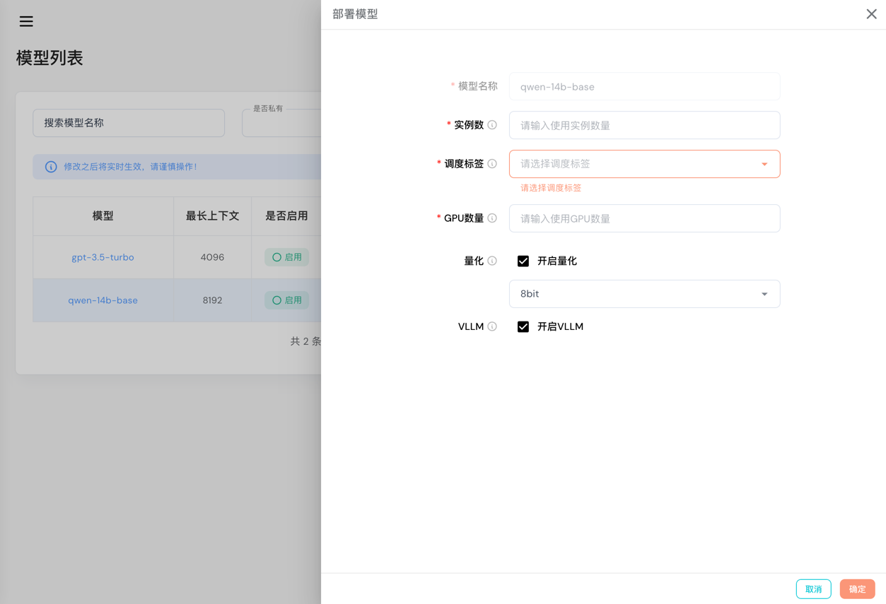

# 模型列表

模型列表展示所有的模型包括外部，私有的以及微调的模型，在该页面可对模型进行部署、管理、删除等操作。

当私有模型部署完，并且设置状态为可用时，会出现“**对话**”按钮，点击可进入[模型操场](playground.md)

## 模型部署

当私有模型没有部署并且状态为关闭时，点击右侧的“**更多**”下拉框然后点击“**部署**”按钮，弹出以下对话框。

- **实例数**: 启动的实例数量，Docker 为启动的容器数量，Kubernetes为启动的Pods数量
- **调度标签**: 调度标签，通常为kubernetes标签，如果您的调度资源是Docker，为实例标签
- **GPU数量**: 每个实例所挂载的GPU数量
- **量化**(可选): float16 或 int8
- **VLLM**: 如果模型支持VLLM的话开启可提高性能