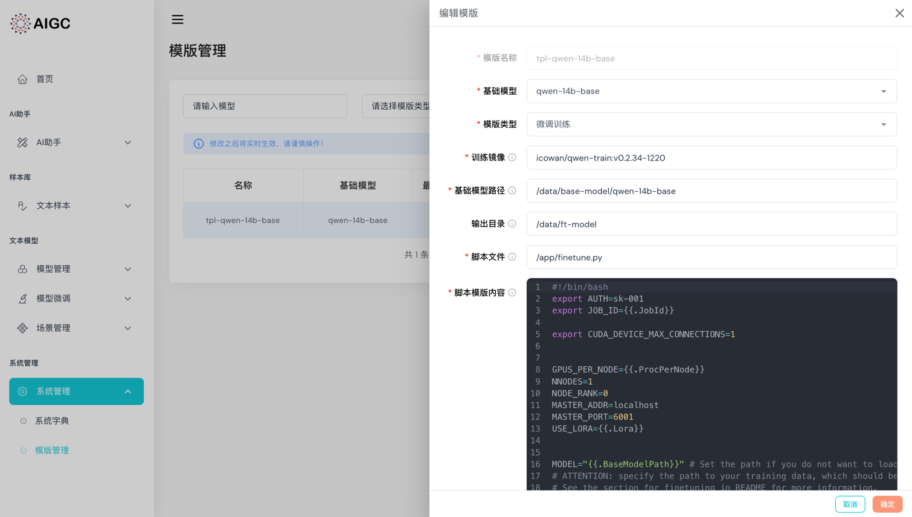

# 模版管理

模版管理是负责管理我们的微调、推理所生成的超参脚本模版，可在该页面速度编辑模版并快速生效。

点击“**添加模版**”，弹出抽屉，填写相关信息。

- **模版名称**: 模版的名称，用于区分不同的模版。
- **基础模型**: 选择基础模型，用于生成模版，‼️注意：基础模型是否可选，得先在[管理管理](../model/list.md)添加相应模型才可选择。
- **训练镜像**: 选择训练镜像，提前制作好相应用的训练镜像。可以[训练Docker镜像制作](../../docker/README.md)查看如何制作镜像。
- **基础模型路径**: 容器起来后模型所挂载到容器里的路径。
- **输出目录**: 模型训练所输出的内容在容器里的路径。
- **脚本文件**: 执行训练的脚本文件，通常是制作在镜像里的python脚本。
- **脚本模版内容**: 脚本模版的内容，可以在这里编辑模版内容。



点击“**保存**”，即可保存模版。

以Qwen模型为例，脚本模版参考:

```shell
#!/bin/bash
export AUTH=sk-001
export JOB_ID={{.JobId}}

export CUDA_DEVICE_MAX_CONNECTIONS=1


GPUS_PER_NODE={{.ProcPerNode}}
NNODES=1
NODE_RANK=0
MASTER_ADDR=localhost
MASTER_PORT=6001
USE_LORA={{.Lora}}


MODEL="{{.BaseModelPath}}" # Set the path if you do not want to load from huggingface directly
# ATTENTION: specify the path to your training data, which should be a json file consisting of a list of conversations.
# See the section for finetuning in README for more information.
DATA="{{.DataPath}}"

DISTRIBUTED_ARGS="
    --nproc_per_node $GPUS_PER_NODE \
    --nnodes $NNODES \
    --node_rank $NODE_RANK \
    --master_addr $MASTER_ADDR \
    --master_port $MASTER_PORT
"

mkdir -p /data/train-data/
wget -O {{.DataPath}} {{.FileUrl}}

if [ "$USE_LORA" -eq 1 ]; then
    USE_LORA=True
    DS_CONFIG_PATH="ds_config_zero2.json"
else
    USE_LORA=False
    DS_CONFIG_PATH="ds_config_zero3.json"
fi

torchrun $DISTRIBUTED_ARGS {{.ScriptFile}} \
    --model_name_or_path $MODEL \
    --data_path $DATA \
    --bf16 True \
    --output_dir {{.OutputDir}} \
    --num_train_epochs {{.TrainEpoch}} \
    --per_device_train_batch_size {{.TrainBatchSize}} \
    --per_device_eval_batch_size {{.EvalBatchSize}} \
    --gradient_accumulation_steps {{.AccumulationSteps}} \
    --evaluation_strategy "no" \
    --save_strategy "steps" \
    --save_steps 1000 \
    --save_total_limit 10 \
    --learning_rate 3e-4 \
    --weight_decay 0.1 \
    --adam_beta2 0.95 \
    --warmup_ratio 0.01 \
    --lr_scheduler_type "cosine" \
    --logging_steps 1 \
    --report_to "none" \
    --model_max_length {{.ModelMaxLength}} \
    --lazy_preprocess True \
    --use_lora $USE_LORA \
    --gradient_checkpointing \
    --deepspeed ${DS_CONFIG_PATH}
```

### Job Configuration Parameters

- `JobId` - string
    - Job标识符

- `FineTunedModel` - 微调模型
    - 微调后的模型名称

- `FileId` - 文件ID
    - 用于训练或微调的文件标识符

- `BaseModel` - 基础模型名称
    - 用作微调基础的模型名称

- `TrainBatchSize` - 训练批次大小（默认值：1）
    - 在训练过程中每个批次的样本数量

- `EvalBatchSize` - 评估批次大小（默认值：1）
    - 在评估过程中每个批次的样本数量

- `AccumulationSteps` - 梯度累加步数（默认值：1）
    - 在执行参数更新之前累加梯度的步数

- `TrainEpoch` - 训练轮次（默认值：1）
    - 完整数据集上的训练轮数

- `ProcPerNode` - 每个节点使用的GPU数量（默认值：1）
    - 每个计算节点上使用的GPU数

- `EvalSteps` - 评估步数（例如：1500）
    - 每隔多少步进行一次模型评估

- `SaveSteps` - 保存步数（例如：1500）
    - 每隔多少步保存一次模型

- `SaveTotalLimit` - 保存总数限制（默认值：8）
    - 保存的模型文件总数上限

- `LearningRate` - 学习率（默认值：2e-5）
    - 优化算法的学习率

- `WeightDecay` - 权重衰减（默认值：0）
    - 用于防止过拟合的权重衰减系数

- `WarmupRatio` - 预热比例（默认值：0.04）
    - 学习率预热的比例

- `LoggingSteps` - 日志步数（默认值：1）
    - 每隔多少步记录日志信息

- `ModelMaxLength` - 模型最大长度（默认值：2048）
    - 模型可以处理的最大序列长度

- `Lora` - 是否微调LoRA
    - 指示是否对LoRA参数进行微调

- `BaseModelPath` - 基础模型路径
    - 预训练模型的存储路径

- `DataPath` - 数据集文件地址
    - 训练和评估所用数据集的文件路径

- `OutputDir` - 输出目录
    - 训练完成后模型输出的目录

- `ScriptFile` - 脚本文件
    - 用于训练的脚本文件名称

- `MasterPort` - master端口
    - 分布式训练时master节点的端口

- `FileUrl` - 文件地址
    - 文件的远程URL地址

- `ValidationFile` - 验证文件
    - 用于模型验证的文件路径

- `TrainScript` - 训练脚本内容
    - 实际执行的训练脚本内容
