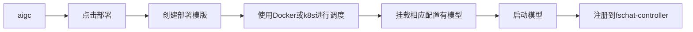
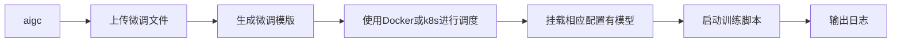

# 系统架构设计

系统是前后端分离的架构。

## 模型推理框架

我们使用的是[FastChat](https://github.com/lm-sys/FastChat)作为模型推理框架，FastChat是一个非常优秀的开源项目。

> [FastChat](https://github.com/lm-sys/FastChat) 是一个开放平台，用于训练、服务和评估基于大型语言模型的聊天机器人。

**FastChat我们主要用其三个服务**

`controller` 用于模型的注册中心及健康检查

`worker` 服务启动模型并将当前模型注册到controller

`api` 从controller获取模型的地址代理到worker并提供标准API

我们主要通过它来实现大模型的高可用，高可扩展性。

## 本系统组成

本系统主要由以下几个部分组成：

- **HTTP服务**：提供Web服务接口，方便用户进行交互。
- **定时任务**：执行预定任务，如模型训练、数据预处理等。
- **训练镜像**：包含所有必要的环境和依赖，用于模型的训练和微调。

- 通过这些组件的协同工作，我们能够提供一个灵活、高效的模型微调和部署解决方案。

### 部署流程

### 微调训练流程

模型部署的操作可以参考[模型部署](docs/model/list.md)
